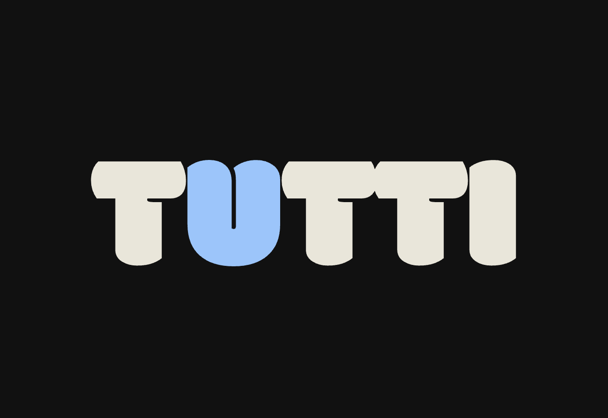

<div align="center">
  
</div>

# Tutti

[](https://crates.io/crates/tutti)
[](https://docs.rs/tutti)
[](https://github.com/PoHsuanLai/Tutti#license)
[](https://github.com/PoHsuanLai/Tutti/actions)

A real-time audio engine for DAW applications in Rust. Tutti provides an audio graph runtime, MIDI processing, sample playback, plugin hosting, and neural audio synthesis.

For audio UI components, see [Armas](https://github.com/PoHsuanLai/Armas).

## Overview

Umbrella crate that coordinates multiple audio subsystems:

- **[tutti-core]** - Audio graph runtime (Net, Transport, Metering, PDC, MIDI routing)
- **[tutti-midi-io]** - MIDI I/O subsystem (Hardware I/O, ports, MPE, MIDI 2.0, CC mapping)
- **[tutti-sampler]** - Sample playback (Butler, streaming, recording, time-stretch)
- **[tutti-dsp]** - DSP nodes (LFO, dynamics, envelope follower, spatial audio)
- **[tutti-plugin]** - Plugin hosting (VST2, VST3, CLAP)
- **[tutti-neural]** - Neural audio (GPU synthesis and effects)
- **[tutti-analysis]** - Audio analysis (waveform, transient, pitch, correlation)
- **[tutti-export]** - Offline rendering and export

## Quick Start

```rust
use tutti::prelude::*;

let engine = TuttiEngine::builder().sample_rate(44100.0).build()?;

// Register custom DSP nodes
engine.add_node("sine", |params| {
    let freq: f64 = get_param_or(params, "frequency", 440.0);
    Ok(Box::new(sine_hz(freq)))
});

engine.add_node("lowpass", |params| {
    let cutoff: f64 = get_param_or(params, "cutoff", 2000.0);
    Ok(Box::new(lowpass_hz(cutoff)))
});

// Instantiate nodes (creates instances and returns NodeIds)
let sine = engine.instance("sine", &params! { "frequency" => 440.0 })?;
let filter = engine.instance("lowpass", &params! { "cutoff" => 2000.0 })?;

// Build audio graph with macros
engine.graph(|net| {
    chain!(net, sine, filter => output);
});

engine.transport().play();
```

## Features

- `default` - Core audio engine only
- `full` - Everything enabled (excludes `neural`)
- `midi` - MIDI subsystem
- `sampler` - Sample playback and recording
- `soundfont` - SoundFont support (requires `sampler`)
- `plugin` - Plugin hosting (VST2/VST3/CLAP)
- `neural` - Neural audio processing (GPU synthesis and effects)
- `analysis` - Audio analysis tools
- `export` - Offline rendering
- `spatial-audio` - VBAP and binaural panning

## Architecture

Tutti uses a modular architecture where each subsystem is an independent crate. The `NodeRegistry` provides dynamic node creation from plugins, neural models, and builtin DSP nodes.

## Examples

### Loading and Instantiating Nodes

```rust
use tutti::prelude::*;

// Create tokio runtime for plugin loading (optional)
let runtime = tokio::runtime::Runtime::new()?;

// Build engine - subsystems enabled via Cargo features
let engine = TuttiEngine::builder()
    .sample_rate(44100.0)
    .plugin_runtime(runtime.handle().clone())  // Optional: for plugin loading
    .build()?;

// Load nodes once (explicit format methods = compile-time type safety)
engine.load_mpk("my_synth", "model.mpk")?;      // Neural model
engine.load_vst3("reverb", "plugin.vst3")?;     // VST3 plugin
engine.load_wav("kick", "kick.wav")?;           // WAV sample

// Add custom DSP nodes programmatically
engine.add_node("my_filter", |params| {
    let cutoff: f32 = get_param_or(params, "cutoff", 1000.0);
    Ok(Box::new(lowpass_hz(cutoff)))
});

// Instantiate nodes (create instances and add to graph)
let synth = engine.instance("my_synth", &params! {})?;
let reverb = engine.instance("reverb", &params! { "room_size" => 0.9 })?;
let filter = engine.instance("my_filter", &params! { "cutoff" => 2000.0 })?;

// Build graph with node IDs
engine.graph(|net| {
    chain!(net, synth, filter, reverb => output);
});
```

### Transport Control (Fluent API)

```rust
use tutti::prelude::*;

let engine = TuttiEngine::builder().build()?;

// Fluent transport API - chainable methods
engine.transport()
    .tempo(128.0)
    .loop_range(0.0, 16.0)
    .enable_loop()
    .play();

// Metronome control
engine.transport()
    .metronome()
    .volume(0.7)
    .accent_every(4)
    .always();

// State queries
let transport = engine.transport();
if transport.is_playing() {
    let beat = transport.current_beat();
    println!("Currently at beat: {}", beat);
}

// Locate and play
transport.locate_and_play(8.0);

// Transport modes
transport.fast_forward();
transport.rewind();
transport.stop();
```

### Streaming and Recording (Butler Thread)

```rust
use tutti::prelude::*;

// Sampler subsystem automatically enabled when 'sampler' feature is compiled
let engine = TuttiEngine::builder().build()?;

let sampler = engine.sampler();

// Stream large files from disk (no memory loading)
sampler.stream("huge_audio_file.wav")
    .channel(0)
    .gain(0.8)
    .speed(1.5)
    .start_sample(44100)  // Start at 1 second
    .start();

// Record audio with ring buffer
let session = sampler.record("recording.wav")
    .channels(2)
    .buffer_seconds(5.0)
    .start();

// Audio callback writes to session.producer

// Stop and flush to disk
sampler.stop_capture(session.id);
sampler.flush_capture(session.id, "final.wav");
```

### Loading and Exporting

```rust
use tutti::prelude::*;

let engine = TuttiEngine::builder().build()?;

// Load audio files
engine.load_wav("kick", "kick.wav")?;
engine.load_flac("snare", "snare.flac")?;

// Instantiate and use in graph
let kick = engine.instance("kick", &params! {})?;
let snare = engine.instance("snare", &params! {})?;

engine.graph(|net| {
    let mix = mix!(net, kick, snare);
    net.pipe_output(mix);
});

// Export to file
engine.export()
    .duration_seconds(10.0)
    .format(AudioFormat::Flac)
    .normalize(NormalizationMode::Lufs(-14.0))
    .to_file("output.flac")?;
```

### MIDI I/O (Fluent API)

```rust
use tutti::prelude::*;

// MIDI subsystem automatically enabled when 'midi' feature is compiled
// Enable it in Cargo.toml: tutti = { version = "...", features = ["midi"] }
let engine = TuttiEngine::builder()
    .midi()  // Opt-in to connect MIDI hardware
    .build()?;

let midi = engine.midi();

// Connect to hardware
midi.connect_device_by_name("Keyboard")?;

// Fluent MIDI output (chainable)
midi.send()
    .note_on(0, 60, 100)
    .cc(0, 74, 64)
    .pitch_bend(0, 0);

// Or single messages
midi.send().note_on(0, 60, 100);
```

### With Multiple Subsystems

```rust
use tutti::prelude::*;

// Enable features in Cargo.toml:
// tutti = { version = "...", features = ["midi", "sampler", "neural"] }

let engine = TuttiEngine::builder()
    .midi()  // Opt-in to connect MIDI hardware
    .build()?;

engine.midi().send().note_on(0, 60, 100);

let sampler = engine.sampler();
sampler.stream("file.wav").start();

let neural = engine.neural();
neural.load_synth("model.mpk")?;
```

### Using Individual Crates

You can also use subsystems independently without the umbrella crate:

```rust
// Just core audio graph
use tutti_core::TuttiSystem;

let system = TuttiSystem::builder().build()?;
system.graph(|net| {
    // Build DSP graph
});
```

```rust
// Just MIDI
use tutti_midi::MidiSystem;

let midi = MidiSystem::new().build()?;
```

## Testing

See [TESTING.md](TESTING.md) for setup instructions.

Quick examples:

```bash
# Plugin loading (see example docs for setup)
cargo run --example plugin_loading --features plugin

# Neural models (run assets/models/create_test_model.py first)
cargo run --example neural_models --features neural

# MIDI synthesizer
cargo run --example midi_synth --features "midi,synth"
```

## License

MIT OR Apache-2.0

[tutti-core]: https://crates.io/crates/tutti-core
[tutti-midi-io]: https://crates.io/crates/tutti-midi-io
[tutti-sampler]: https://crates.io/crates/tutti-sampler
[tutti-dsp]: https://crates.io/crates/tutti-dsp
[tutti-plugin]: https://crates.io/crates/tutti-plugin
[tutti-neural]: https://crates.io/crates/tutti-neural
[tutti-analysis]: https://crates.io/crates/tutti-analysis
[tutti-export]: https://crates.io/crates/tutti-export
